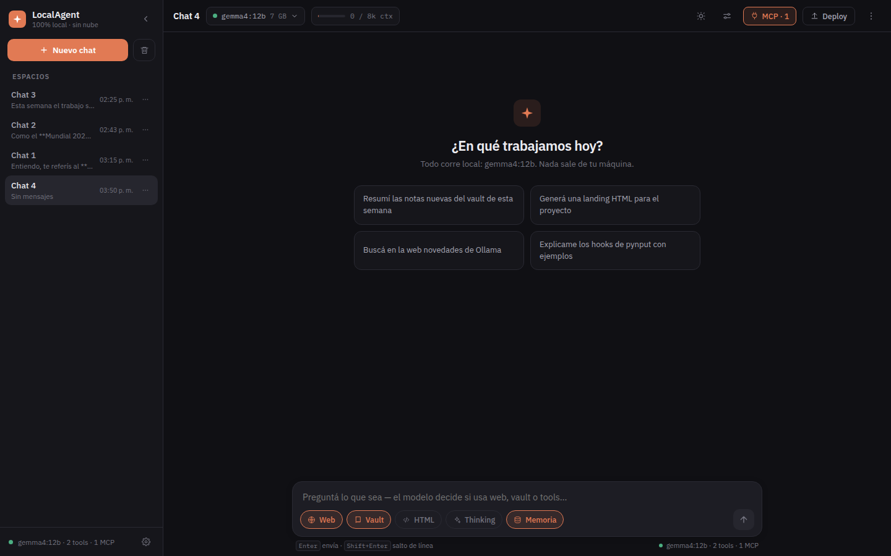
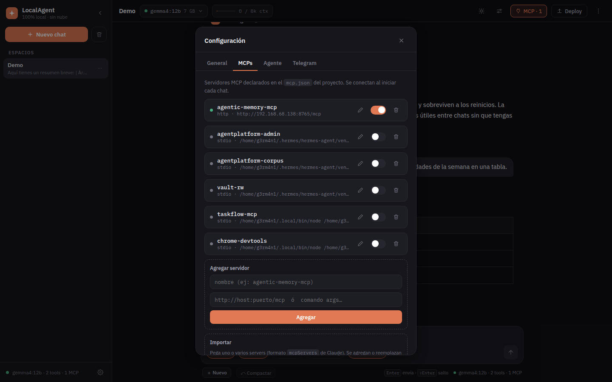
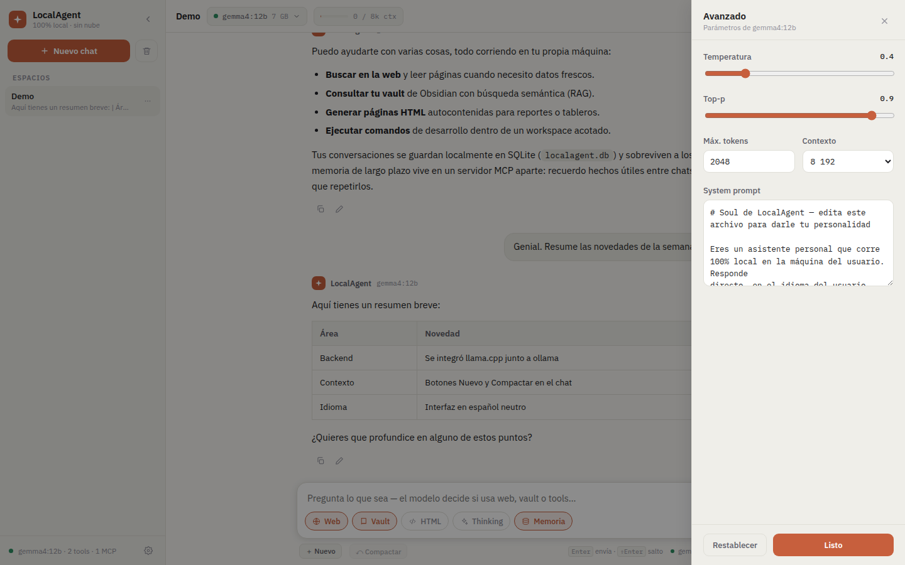

<div align="center">


# LocalAgent

**Agente de IA local, libre y para todos.**

Chat multi-sesión con modelos locales (ollama), memoria persistente por MCP,
tools (web, vault/RAG, filesystem, HTML) y presencia en web + Telegram.
**Cero nube, cero API keys de pago.**




</div>

> Software libre (MIT). El conocimiento se comparte: clona, usa, modifica, comparte.

---

## 📸 Capturas

<table>
  <tr>
    <td width="50%"><br><sub><b>Config → MCPs</b> — ver/editar servidores, alta y baja desde la UI</sub></td>
    <td width="50%"><br><sub><b>Panel Avanzado</b> — sampling y system prompt, con tema claro</sub></td>
  </tr>
</table>

---

## 📖 Cómo funciona

Documentación técnica: arquitectura, ciclo de un turno, MCP, memoria, seguridad y buenas
prácticas.

- 📄 **[Leer en GitHub (markdown)](docs/como-funciona.md)** — se lee directo, sin descargar nada.
- 🖥️ **[Versión interactiva (HTML)](docs/como-funciona.html)** — misma info con acordeón y
  nav; descárgala y ábrela en el navegador (GitHub no renderiza HTML, muestra el fuente).
- 🦙 **[Backend llama.cpp](docs/llama-cpp.md)** — correr modelos con MTP / cuantizaciones
  exóticas (ej. Qwen3.6-35B-A3B) además de ollama.

> Las dos primeras tienen el **mismo contenido**; elige la que te resulte más cómoda.

## 💡 Por qué existe

No busca competirle en features a los clientes grandes de Ollama. Su gracia es otra: es
**chico y legible** — un núcleo de agente en Python que puedes leer, entender y forkear en
una tarde. Sin build step, sin cadena de JS, sin nube. El anti-"caja negra": un repo
donde un PR se entiende sin arqueología.

Tres principios, los mismos que [mcp-memory](https://github.com/GermaniU/mcp-memory):

- **Todo en tu máquina** — el modelo, las conversaciones y la memoria; nada sale de tu LAN.
- **Una conexión, muchas piezas** — se arma con servidores MCP estándar que también usan
  otros clientes (Claude Code, Cursor, …). Lo que conectas aquí sirve en todos.
- **Config sin sobrecarga** — con solo tener ollama ya arranca; lo demás es opcional y
  degrada solo si no lo configuras.

---

## ⚡ Quickstart

```bash
cp .env.example .env   # ajusta lo que uses (solo OLLAMA_URL es imprescindible)
./run-spa.sh           # UI web (SPA) en http://localhost:8585
```

Otros modos de arranque:

```bash
./run.sh               # UI clásica en Streamlit  → http://localhost:8501
./run-bot.sh           # bot de Telegram (requiere TELEGRAM_BOT_TOKEN en .env)
PORT=9000 ./run-spa.sh # SPA en otro puerto
```

Con solo tener **ollama** con un modelo de chat ya funciona. Memoria (MCP), vault/RAG y
Telegram son opcionales.

---

## 🧠 Memoria persistente — combinar con mcp-memory

LocalAgent **no reinventa la memoria**: la delega en un servidor MCP dedicado. El default
es [**mcp-memory**](https://github.com/GermaniU/mcp-memory) — memoria local con búsqueda
semántica (Ollama embeddings + Qdrant) que corre en tu máquina o en otra de tu LAN.

Así se combinan: mcp-memory expone las tools (`memory_save`, `memory_search`, `memory_recent`,
…) y LocalAgent es uno de sus **clientes**. El modelo local decide cuándo guardar un hecho
y cuándo recuperarlo, sin que tú toques nada.

```jsonc
// mcp.json  (en la raíz del proyecto — mismo formato que Claude)
{
  "mcpServers": {
    "agentic-memory-mcp": {
      "type": "http",
      "url": "http://localhost:8765/mcp"   // o la IP de la máquina donde corre mcp-memory
    }
  }
}
```

Levanta mcp-memory (ver su [Quickstart](https://github.com/GermaniU/mcp-memory)), apunta
la URL en `mcp.json`, y en la UI **Config → MCPs** vas a ver el server: puedes
activarlo/desactivarlo por chat, y **ver/editar su configuración** desde ahí mismo.

---

## 🔌 Conectar más servidores MCP

LocalAgent usa un `mcp.json` **propio del proyecto** (no hereda el de Claude). Sin archivo
= ningún MCP. Formato idéntico al `mcpServers` de Claude (override con `MCP_CONFIG`).

Hay **dos tipos** de servidor:

- **HTTP** (`type: http` + `url`) — un server remoto/en la LAN. Ej.: mcp-memory en otra máquina.
- **stdio** (`command` + `args` [+ `env`]) — un **proceso local** que LocalAgent arranca:
  un script Python, Node, lo que sea. Es como corren los MCP propios (AgentPlatform, vault, …).

```jsonc
{
  "mcpServers": {
    // remoto por HTTP
    "mcp-memory": { "type": "http", "url": "http://192.168.68.138:8765/mcp" },

    // MCP local en Python (stdio): intérprete + ruta al script + variables de entorno
    "vault-rw": {
      "command": "/home/usuario/.venv/bin/python",
      "args": ["/mnt/c/Sites/AgentPlatform/mcp/vault_rw/vault_rw.py"],
      "env": { "VAULT_PATH": "/mnt/c/Sites/Data" }   // referencia al vault local
    },

    // MCP local en Node (stdio)
    "taskflow": {
      "command": "node",
      "args": ["/home/usuario/taskflow-mcp/dist/index.js"],
      "env": { "TASKFLOW_API_URL": "http://…", "TASKFLOW_API_KEY": "…" }
    }
  }
}
```

> **Rutas**: en stdio los `command`/`args` son **paths de ESTA máquina**. Si migras una
> config de otra máquina (ej. de una Mac), ajusta las rutas (en WSL, `/mnt/c/Sites/…`) y el
> intérprete. Un MCP HTTP anda desde cualquier lado si el host es alcanzable.

Se edita a mano o **todo desde la UI** (**Config → MCPs**):

- **Agregar rápido**: nombre + destino (URL http → server HTTP; un comando → stdio).
- **Importar**: pegas un bloque `mcpServers` entero (uno o varios servers) y los mergea.
- **Ver / editar**: cada server abre su **config JSON cruda** editable (tipo, args, `env`
  con valores) — así se configura cualquier MCP, no solo los casos simples.
- **Activar por chat**: un toggle decide si sus tools se ofrecen al modelo. Ojo: cada MCP
  suma sus tools al prompt — activa pocos (ver [perf](docs/llama-cpp.md)).

Ver `mcp.json.example`. El `mcp.json` está **git-ignored** (puede llevar claves en `env`).

---

## 🛠 Capacidades

| Capacidad | Qué habilita |
|---|---|
| **Web** | buscar en la web y leer páginas (`web_search` / `web_fetch`) |
| **Vault** | buscar y leer tus notas de Obsidian por RAG (`vault_search`) |
| **HTML** | generar documentos/páginas HTML (`write_html`) |
| **Thinking** | razonamiento extendido (solo en modelos que lo soportan) |
| **Memoria** | recordar hechos entre chats vía mcp-memory (auto-recall + auto-save) |
| **MCP** | cualquier tool de los servidores declarados en `mcp.json` (editor genérico + importar bloque) |
| **Filesystem / Shell** | crear proyectos y correr comandos, confinado a `WORKSPACE_DIR` |
| **Contexto** | **Nuevo** + **Compactar** (resume la conversación para liberar contexto) + auto-compact al 85% |
| **Backend llama.cpp** | usar modelos de `llama-server` (MTP, cuantizaciones exóticas) junto a ollama — [docs](docs/llama-cpp.md) |

Cada capacidad se prende/apaga por chat desde el compositor.

---

## 🎯 Alcance actual

**Lo que hace** ✅
- Chat multi-sesión en streaming con modelos locales, selección por VRAM.
- Dos backends: **ollama** y **llama.cpp** (`llama-server`, con MTP) — sus modelos aparecen juntos.
- Memoria persistente semántica (vía mcp-memory) y RAG sobre tus notas.
- Tools locales con guardas + puente a cualquier servidor MCP (en ambos backends).
- Gestión de contexto: nuevo chat, compactar y auto-compact.
- Dos frentes: UI web (SPA) y bot de Telegram, sobre el mismo núcleo (`agent.run_turn`).

**Lo que NO hace (todavía)** ❌
- No es un sandbox: `run_cmd` corre comandos de dev que el modelo decide.
- No sincroniza sesiones entre máquinas (SQLite local).
- No multi-usuario / multi-tenant.

---

## 🧱 Arquitectura

```
┌─────────────┐   ┌───────────────┐
│  UI web SPA │   │  bot Telegram │       gateways (mismo núcleo)
│   :8585     │   │               │
└──────┬──────┘   └──────┬────────┘
       └────────┬────────┘
                ▼
        ┌────────────────┐   agent.run_turn (un turno se resuelve igual en todos)
        │  núcleo agente │
        └───────┬────────┘
     ┌──────────┼───────────────┬──────────────┐
     ▼          ▼               ▼              ▼
┌──────────┐ ┌────────┐  ┌────────────┐  ┌──────────┐
│ modelos  │ │ tools  │  │ mcp_bridge │  │  vault   │
│          │ │ locales│  │ (mcp.json) │  │  (RAG)   │
│ ollama   │ └────────┘  └─────┬──────┘  └──────────┘
│ llama.cpp│                   ▼
│ (:8080,  │          ┌──────────────────┐
│  OpenAI) │          │  mcp-memory      │  memoria semántica
└──────────┘          │  (otra máquina)  │  Ollama emb + Qdrant
                      └──────────────────┘
```

La lógica de un turno vive en `agent.run_turn`, así **UI y bot no divergen**. El chat
puede ir a **ollama** o al backend **llama.cpp** (OpenAI-compatible), transparente al núcleo.

---

## 🖥 Módulos

- `api.py` — backend FastAPI que sirve la SPA (`web/`) y expone el agente por HTTP.
- `web/` — frontend SPA en JS vanilla (sin build): `app.js`, `index.html`, `style.css`.
- `app.py` — UI clásica en Streamlit (alternativa a la SPA).
- `telegram_bot.py` — bot de Telegram (mismo núcleo y tools).
- `agent.py` — núcleo compartido: `run_turn` (loop de un turno) + `build_system` + `finalize`.
- `clients.py` — clientes de inferencia: ollama (chat, streaming con tools) + backend
  OpenAI-compatible (llama.cpp, con tools) + corpus/RAG.
- `tools.py` — tools locales: web, vault, filesystem, shell (con guardas), HTML, skills.
- `memory.py` — memoria persistente sobre mcp-memory (auto-recall + auto-save).
- `mcp_bridge.py` — conecta los servers de `mcp.json` y expone sus tools.
- `prompts.py` + `prompts/` — prompts externalizados (soul, extracción de memoria, resumen…).
- `skills.py` + `skills/` — procedimientos reutilizables (`use_skill`).
- `store.py` — persistencia de conversaciones (SQLite).
- `trace.py` — trazabilidad (JSONL) de cada turno.
- `config.py` — endpoints y parámetros (todo override por env var).
- `tests/` — suite de pytest (guardas de path, denylist de shell, store, MCP, compact…).

---

## 🎨 Personalizar

- **Personalidad:** edita `soul.md` (es el system prompt; se recarga en caliente). También
  desde la UI en **Config → Agente**.
- **Skills:** agrega un `.md` con frontmatter (`name`, `description`) en `skills/`.
- **Parámetros:** temperatura, top-p, máx. tokens, contexto y system prompt desde el panel
  **Avanzado** de la UI.
- **Tema:** claro/oscuro desde la UI; tokens de color en `web/style.css`.

---

## 🔒 Seguridad

`run_cmd` bloquea patrones destructivos y corre confinado a `WORKSPACE_DIR`, pero **no es
un sandbox**: ejecuta comandos de dev que el modelo decide. Los secretos (token de Telegram,
`env` de MCP servers, etc.) viven en `.env` / `mcp.json`, ambos git-ignored. Mantén criterio
sobre lo que ejecuta, sobre todo con entradas de terceros. El backend restringe CORS a
localhost y valida el path de los estáticos.

---

## 🩹 Troubleshooting

- **La UI tarda en cargar** → algún servicio opcional (MCP remoto) no responde. Los MCP se
  conectan al iniciar cada chat; desactiva el que esté caído en **Config → MCPs**.
- **El modelo escupe el tool call como texto en vez de ejecutarlo** → ese modelo no maneja
  bien tools. Prueba con `gemma4:12b` u otro que soporte function-calling.
- **La memoria no guarda nada** → verifica que mcp-memory esté arriba y la URL de `mcp.json`
  sea alcanzable (`curl http://host:8765/mcp`), y que el server esté activo en la UI.
- **Respuestas cortadas** → sube "Máx. tokens" en el panel Avanzado.

---

## 📋 Requisitos

- ollama con al menos un modelo de chat local.
- Python 3.12+, deps en `requirements.txt`.
- (Opcional) [mcp-memory](https://github.com/GermaniU/mcp-memory) para memoria persistente,
  y un corpus/RAG para el vault.

---

## 🤝 Contribuir

Los PRs son bienvenidos. La idea es que el código siga siendo **legible**: cambios chicos y
enfocados, sin dependencias de más, en el mismo estilo del módulo que tocas. Para algo
grande, abre un issue primero y lo charlamos.

### Contribuidores

- **[@GermaniU](https://github.com/GermaniU)** — autor y mantenedor.
- **Revisión de código con modelos cloud de ollama** — parte del código pasó por
  revisiones asistidas por **Kimi K2**, **GLM-5.2** y **DeepSeek V4-Pro** (vía `ollama`
  cloud), que ayudaron a detectar bugs y a pulir el diseño.

---

## ☕ Apoyar

Es gratis y libre. Si te sirve y puedes, invitame un café:

[](https://paypal.me/GermaniUicab)

→ **[paypal.me/GermaniUicab](https://paypal.me/GermaniUicab)**

## 📄 Licencia

[MIT](LICENSE) — libre para usar, modificar y compartir.

Hecho por [@GermaniU](https://github.com/GermaniU). Si te sirve, dale una ⭐ y reporta issues.
